Documentation of Project Implementation for IPP 2023/2024 2nd task
Name and surname: Dmytro Khodarevskyi
Login: xkhoda01

# Project Documentation: `interpret.php`

## Overview
<!-- Provide a brief introduction to the purpose and functionality of the `interpret.php` script. -->

The `interpret.php` script is a PHP interpreter for the IPPcode24 language. It reads an XML representation of the IPPcode24 program from standard input and executes the program according to the semantics of the language. The script supports a variety of instructions, including arithmetic operations, control structures, and variable manipulation.

## Philosophy of Design
<!-- Discuss the overarching design principles and philosophies guiding the development of the script. -->

The primary design principle of the `interpret.php` script is modularity and extensibility. The script is designed to be easily extended with new instructions and features, allowing for the addition of new functionality without modifying existing code. The script is also designed to be easy to read and understand, with clear separation of concerns.

## Approach and Methodology
<!-- Describe the specific approach and methodology employed in developing the script, including handling of ambiguous cases, extension mechanisms, and utilization of design patterns. -->

The `interpret.php` script is an object-oriented PHP code interpreter. At first it validates the proper XML format of the input program and then parses the XML representation into a sequence of instructions. 

Then the script collects and creates necessary data structures to store the program state, such as a symbol tables for variables (`Frames`), operations stack (`DataStack`) and a call stack for function calls (`labels_array / return_array`). 

The script then executes these instructions in order, updating the program state as necessary. The script is designed to be modular and extensible, allowing for easy addition of new instructions and features.

*Throughout the program, the script throws any errors that occur during the execution of the program with proper `IPPException` class, such as invalid instructions, invalid operands, or invalid program state, and returns the suitable return code.*

## Internal Representation

Below is a **brief** *(not all functions are described below to avoid unnecessary complexity)* description of the key classes and their responsibilities within the `interpret.php` script:

* **XML_to_code** - transforms XML to instructions
  where each instruction is an instance of `instruction` class, and `instructions` is an array of instructions

* **Check** - checks the validity of the string by its type (int, bool, string, nil, label, type, var)

* **Variable** - representation of variable
  *  **checkFrames()** - checks if the specified frame is valid and returns it
  *  **do_i_exist()** - checks if the variable exists in the frame

* **Instruction** - representation of instruction
  * **$opcode** - operation code
  * **$order** - order number
  * **$types** - type of the instruction
  * **$args** - array of arguments

* **Frames** - representation of frames
  * **$temporary_frame** - temporary frame 
  * **$global_frame** - global frame 
  * **$local_frames** - local frames array 
  * **$temporary_frame_active** - temporary existence flag 
  *  **pushframe()** - pushes the TF frame to LF frames
  *  **popframe()** - pops the top frame from LF frames to TF frame
  *  **createframe()** - creates a new TF frame
  * *GetSet methods...*

* **Frame** - representation of basic frame
  * **$frame** - an array of variables
  * **$name** - name of the frame (TF, LF, GF)
  * **$types** - array of types of the variables
  * **$init** - initialization flag array (used specifically for Type instruction)
  * **writeFrame()** - writes the frame to the output *(for debugging purposes)*
  * *Variable and Frame GetSet methods...*

* **DataStack** - stack for operations
  * **$data_stack** - stack array
  * **$data_stack_types** - stack array types
  * **PrintStack()** - prints the stack *(for debugging purposes)*
  * *All the stack operation methods such as pushs, pops etc. (including Extenstion of task)*

* **InstrTrait** - breaks the string into variable and returns its instance

* **SymbTrait** - parses variable and returns its value if present in frame

## UML Class Diagram
Include a UML class diagram illustrating the class structure and relationships within the `interpret.php` script.

Here you can see the **UML representation** of the internal structure of the `interpret.php` script:

```mermaid
classDiagram
    class Interpreter {
    }

    class _Exit {
    }

    class Arithmetic {
    }

    class Boolean {
    }

    class Check {
      // checks the validity 
      // of the string
      // by it's type
    }

    class Concat {
    }

    class DataStack {
      // stack for operations
    }

    class Defvar {
    }

    class Getchar {
    }

    class instruction {
    }

    class Int2char {
    }

    class Jumpifeq {
      // also JUMPIFNEQ
    }

    class Move {
    }

    class Read {
    }

    class Relative {
    }

    class Setchar {
    }

    class Str2int {
    }

    class StringTransformer {
      // tranforms decadic code
      // to ASCII symbols
    }

    class Strlen {
    }

    class Type {
    }

    class Write {
    }

    class XML_to_code {
      // transforms XML to instructions
    }

    class ValidateXML {
      // check XML format
    }

    class Variable {
    }

    class SymbTrait {
      // parses variable and returns its value
      // if present in frame 
    }

    class InstrTrait {
      // breaks the string into variable,
      // and returns its instance
    }

    note "All exceptions are in classes that extend in IPPException, and used almost everywhere in the code."

    Getchar -- InstrTrait
    Defvar -- InstrTrait
    Read -- InstrTrait
    Jumpifeq -- InstrTrait
    Concat -- InstrTrait
    DataStack -- InstrTrait
    Int2char -- InstrTrait
    Move -- InstrTrait
    Arithmetic -- InstrTrait
    Boolean -- InstrTrait
    Setchar -- InstrTrait
    Strlen -- InstrTrait
    Type -- InstrTrait
    Str2int -- InstrTrait
    _Exit -- InstrTrait
    Relative -- InstrTrait

    Relative -- SymbTrait
    Setchar -- SymbTrait
    Move -- SymbTrait
    Jumpifeq -- SymbTrait
    Concat -- SymbTrait
    Boolean -- SymbTrait
    Arithmetic -- SymbTrait
    Str2int -- SymbTrait
    Strlen -- SymbTrait
    Type -- SymbTrait
    _Exit -- SymbTrait

    SymbTrait -- Variable

    Interpreter -- StringTransformer
    Interpreter -- XML_to_code
    Interpreter -- ValidateXML
    StringTransformer .. Write

    Interpreter -- _Exit
    Interpreter -- Arithmetic
    Interpreter -- Boolean
    Interpreter -- Concat
    Interpreter -- DataStack
    Interpreter -- Defvar
    Interpreter -- Frames
    Interpreter -- Getchar
    Interpreter -- Int2char
    Interpreter -- Jumpifeq
    Interpreter -- Move
    Interpreter -- Read
    Interpreter -- Relative
    Interpreter -- Setchar
    Interpreter -- Str2int
    Interpreter -- Strlen
    Interpreter -- Type
    Interpreter -- Write

    XML_to_code o-- instruction
    XML_to_code -- Check

    class Frames {
    // Global frame, 
    // Local frames, 
    // Temporary frame
    }

    class Frame {
    // CRUD operations
    }

    Frames *-- Frame
```

## Implemented Features

**STACK** extension was implemented in the project. The stack is used for storing the values of the variables and the results of the operations.

